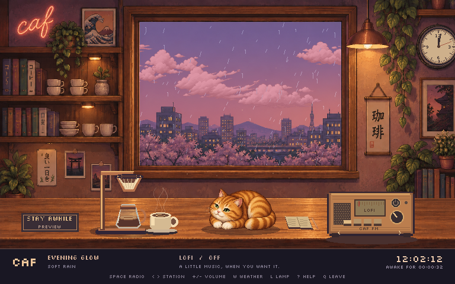

# caf

**Stay a little longer.** Keep your Mac awake in a living pixel-art café inside your terminal, with a real clock on the wall, a slow pour-over, Miso the cat, and lo-fi drifting from the radio.



## Install

Requires **macOS**, [Ghostty](https://ghostty.org/) with Kitty graphics support, and [uv](https://docs.astral.sh/uv/). The interactive app has been tested in Ghostty 1.3.1. Other terminals are unverified. Python 3.11+ is required; uv can install it automatically. [mpv](https://mpv.io/) is optional and enables the radio.

With [Homebrew](https://brew.sh/) installed:

```sh
brew install uv mpv
git clone https://github.com/tomc98/caf.git
cd caf
./caf
```

Run this inside Ghostty, directly or [through tmux](#tmux). On first launch, caf installs its locked Python dependencies into the checkout's `.venv`. Subsequent launches work offline with the radio off.

`./caf --check` reports local dependencies.

To run `caf` from anywhere:

```sh
./install.sh
caf
```

The installer writes a launcher to `~/.local/bin/caf`, backing up any existing file under `.backups/`. Keep the checkout in place. If the command isn't found, add `export PATH="$HOME/.local/bin:$PATH"` to your shell profile and open a new terminal.

To update a clone, run `git pull --ff-only` followed by `uv sync --locked --no-dev`. To uninstall, delete `~/.local/bin/caf`. Radio preferences are saved in `~/.config/caf/radio.json`, or `$XDG_CONFIG_HOME/caf/radio.json` when configured.

## tmux

caf works in tmux panes inside Ghostty, tested with Ghostty 1.3.1 and tmux 3.7c. Add these settings to `~/.tmux.conf`:

```tmux
set -g allow-passthrough on
set -g mouse on
```

Apply them to a running server without restarting your sessions:

```sh
tmux set -g allow-passthrough on
tmux set -g mouse on
```

Then launch tmux inside Ghostty and run `./caf` from the checkout, or `caf` if you installed the launcher. caf detects tmux automatically.

`allow-passthrough` lets Ghostty display the artwork; `mouse` enables clicking the radio, lamp, cat, and other controls. Keyboard controls also work with mouse support disabled. You can split panes, zoom the café, and switch windows. Nested tmux sessions are unverified.

## Make yourself at home

| Control | Action |
| --- | --- |
| Click radio power / Space | Music on or off |
| Radio arrows / Left, Right | Previous or next station |
| Radio preset buttons / 1–4 | Tune a preset |
| Scroll over radio / +, − | Volume |
| Click window / W | Automatic weather, clear, cloudy, rain |
| Click pendant lamp / L | Low, warm, extra cozy light |
| Click Miso / C | Say hello |
| Click coffee / B | Fresh cup |
| ? / H | Show controls |
| Q / Ctrl+C | Close the café |

The radio starts **off**, remembers the station and volume, displays stream metadata when available, and reconnects if a stream fails. Presets are laut.fm Lofi, SomaFM Fluid, Groove Salad, and Drone Zone. These are live stations: availability, programming, and any station advertising are controlled by their broadcasters. Audio is played locally through mpv.

## A little place with its own rhythm

- **Real local time:** both the wall clock and digital clock read the Mac's local time. The elapsed keep-awake timer is independent.
- **Day and night:** dawn, daylight, dusk, and midnight artwork blend gradually according to local time. Sunbeams, lighting, moving celestial objects, stars, and cat routines follow the time of day. Preview controls change the scenery, never the real clock.
- **Weather:** an ambient 12-minute cycle moves from clear skies to gathering clouds, arriving rain, a shower, easing rain, and slowly drying glass. It is fictional café weather, not a live forecast. All clouds, sun, moon, stars, and precipitation are separate moving layers; none are baked into the room backgrounds.
- **Miso:** breathes, naps, looks around, stretches, twitches her tail, and responds to a greeting.
- **Coffee:** droplets gather under the filter, fall into the carafe, and create a ripple; steam curls independently over the cup. A fresh cup slides in on the hour.
- **Small moments:** drifting dust, distant trains, birds, passing headlights, and a rare heart in the steam.

## Keep-awake behaviour

While the café is open, `caffeinate -di -w <caf pid>` keeps the display on and prevents idle system sleep. The counter sign reflects the live process. If caffeinate unexpectedly stops, the app closes with an error instead of claiming the Mac is still awake.

Normal exit, Ctrl+C, SIGTERM, and SIGHUP stop the radio and caffeinate and restore terminal modes, cursor, title, and alternate screen. Both audio and caffeinate are tied to the application's lifetime, including an abrupt parent-process death. Closing a laptop lid and explicit system sleep still follow macOS rules.

## Preview and verification

```sh
./caf --weather rain
./caf --time 23:00             # midnight scenery; real clock stays real
./caf --demo                   # a lighting day in 144 seconds
./caf --render work/night.png --time 23:00 --weather rain
./caf --fps 8                  # 12 fps by default, at most 6 when unfocused
```

The renderer uses Pillow for a 768×480 pixel-art canvas and Kitty graphics to display it. It caches text and sends only changed image tiles. Mouse targets follow the displayed scene through resizing and letterboxing. Small windows scale down the same scene; a roomy terminal or fullscreen is best for the artwork.

`--seconds N` closes automatically. `--diagnostics PATH` writes the local process IDs, stream state, geometry, and animation frame count for troubleshooting. No telemetry is sent. The radio contacts its broadcaster only when enabled; dependency setup contacts the package registry on first install or update.

## Troubleshooting

- **Kitty graphics rejected:** check that the outer terminal is Ghostty. In tmux, enable `allow-passthrough` as described above. Other multiplexers are unverified. Kitty keyboard support alone does not imply graphics support.
- **Radio says NEEDS MPV:** run `brew install mpv`, then toggle the radio again. `./caf --check` reports whether mpv is on your path.
- **A station stays on RECONNECTING:** try another preset and check your connection. Stations can change their endpoints or temporarily go offline.
- **Artwork feels small or busy:** enlarge the terminal or use fullscreen; `./caf --fps 8` reduces redraw work.

Development instructions are in [CONTRIBUTING.md](CONTRIBUTING.md). See [VALIDATION.md](VALIDATION.md) for what has been checked.

## Artwork and credits

Room backgrounds, independent cloud sprites, and Miso's pose atlas are AI-generated artwork made for this project with OpenAI's image-generation tool. The coffee, radio, clock, weather, and other animated details are drawn in code. See [artwork provenance](caf_app/assets/ARTWORK.md).

[Silkscreen](https://github.com/googlefonts/silkscreen) is by Jason Kottke and contributors, distributed under the [SIL Open Font License](caf_app/assets/FONT-LICENSE.txt).

Radio sources: [laut.fm Lofi](https://laut.fm/lofi), [SomaFM streams](https://somafm.com/listen/), and [SomaFM's player links](https://somafm.com/fluid/directstreamlinks.html). caf is an independent player and is not affiliated with these broadcasters. Music is streamed directly, never bundled or recorded. Support the stations if you enjoy them.

## License

Code and project artwork are released under [MIT](LICENSE). The bundled Silkscreen font retains its separate OFL-1.1 license. Radio broadcasts and station names remain the property of their respective owners; this project's license does not cover them.
